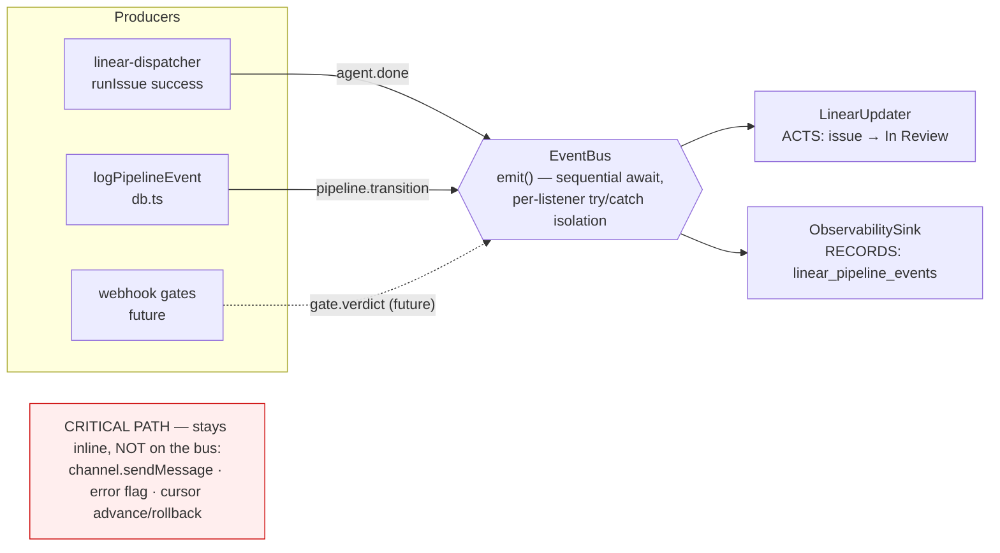

# ADR: Orchestrator Event Hub -- In-Process Pub/Sub for Pipeline Events

**Status:** Accepted (incremental -- Phases 1-2 shipped, 3-14 planned)
**Date:** 2026-05-31
**Scope:** `src/events/`, `src/db.ts` (`logPipelineEvent`/`insertPipelineEventRow`), `src/linear-dispatcher.ts`, `src/index.ts`
**Wardens consulted:** Plan Agent, Code Reviewer, Advisor

## Context

The orchestrator grew several divergent ways of reacting to "something
happened." A Linear dispatch writes the issue state inline; the webhook gate
posts a verdict inline; the message path updates context-stats inline; the
pipeline log is written by a direct `logPipelineEvent` call at ~11 sites. Each
call site is effectively a hardwired listener -- adding a new reaction (e.g.
capturing a coding-failure lesson, or mirroring events for observability) means
editing every producer.

Three forces pushed toward a seam:

1. **Coupling.** Producers (dispatcher, webhook, message loop) know about every
   consumer. A new consumer is an invasive, cross-cutting edit.
2. **No shared vocabulary.** The event-type strings already exist
   (`agent_completed`, `pr_created`, `gate_ship`, ...) but they are *logged*, not
   *dispatched* -- nothing can subscribe to them.
3. **Two event systems.** A private orchestrator already had its own bus; the
   public app had none. Unifying them needs one neutral envelope.

## Decision

Introduce a single **in-process event bus** (`src/events/`) that sits *above* the
existing direct writes. Producers emit a typed, namespaced envelope; any number
of independent listeners subscribe and react. The bus is the pattern
**source -> event -> listener**.

Migration is a **strangler**, never a big-bang rewrite. For each existing direct
write:

1. **Emit alongside** the existing inline write (additive, zero behavior change).
2. **Build a listener** that reproduces the write, registered **dry-run**
   (log-only) so the emit path runs end-to-end on real traffic without
   double-writing.
3. **Confirm parity**, then **cut over**: flip the listener live and **delete the
   inline write** -- one write site per branch.

This keeps every step shippable and reversible, and lets the bus and its
consumers grow without a flag day.

## Architecture



### The envelope (`src/events/types.ts`)

One namespaced envelope unifies the divergent event models:

```ts
interface EventEnvelope {
  type: DeusEvent['type'];        // discriminator, e.g. 'agent.done'
  source: string;                 // who emitted, e.g. 'db.logPipelineEvent'
  actor: 'agent' | 'bot' | 'human' | 'system';
  correlationId: CorrelationRef;  // issue | task | group | run
  ts: string;                     // ISO 8601
  payload: DeusEvent['payload'];  // narrowed by `type`
}
```

`CorrelationRef` is a namespaced union (`issue`/`task`/`group`/`run`) so one bus
carries chat-driven turns **and** Linear-driven outcomes. `DeusEvent` is a
discriminated union; a new phase adds a member additively. Today it carries
`agent.done` and `pipeline.transition`.

### The bus (`src/events/bus.ts`)

`EventBus` exposes three operations, plus a lazy `getBus()` singleton wired at the
composition root (`index.ts`):

| Operation | Contract |
|-----------|----------|
| `subscribe(type, h)` | typed subscription; handler receives the narrowed envelope for that type |
| `on(h)` | catch-all (every event); reserved for a future multi-family durability mirror |
| `emit(env)` | delivers to catch-all then type-matched handlers, **sequentially awaited**, each in its own `try/catch` |

Three properties are correctness, not style:

- **Sequential await** preserves the per-turn ordering the orchestrator's output
  chain already guarantees.
- **Per-listener `try/catch` isolation** -- a thrown handler cannot break the
  emitter or its siblings.
- **Pure contract** -- `emit` returns `Promise<void>` and never reports
  per-listener success. A success-coupled follow-up therefore lives *inside* the
  listener that owns the write, never bolted onto `emit`.

### The listeners (`src/events/listeners/`)

Two kinds, by intent:

- **`LinearUpdater` -- it ACTS.** On `agent.done` it moves the issue to *In
  Review* and fires the two success-coupled bookkeeping events as one atomic
  unit (the state write is awaited first, so a failed write skips the follow-ups
  -- a false `circuit_breaker_reset` would mask repeat failures).
- **`ObservabilitySink` -- it RECORDS.** On `pipeline.transition` it mirrors the
  event into `linear_pipeline_events` (the table that backs `deus pipeline` and
  the rolling Pipeline Log comment).

### Loop-safety (load-bearing)

`logPipelineEvent` both writes the row **and** emits `pipeline.transition`. The
ObservabilitySink must therefore write via the non-emitting
`insertPipelineEventRow` helper, **never** `logPipelineEvent` -- otherwise every
mirrored row would re-emit and the bus would loop forever. The split between the
emitting and non-emitting writers makes that loop structurally impossible.

### Critical path stays inline

User-visible delivery (`channel.sendMessage`), the error flag, and cursor
advance/rollback are **never** moved onto the bus -- their exactly-once and
rollback guarantees differ from best-effort observers. The bus carries
reactions; it does not replace the delivery path or the file-based container IPC
transport.

## Dry-run staging

A listener ships `DRY_RUN_DEFAULT = true`: it receives events and logs what it
*would* write, while the original inline write stays authoritative. This proves
the emit path on real traffic with **zero behavior change**, then a later cutover
PR flips it live and deletes the inline write.

Phase 1's LinearUpdater has completed this cutover (Step 2): the listener is now
the sole writer of the "→ In Review" transition and the dispatcher's inline copy
was deleted — the "confirm parity → delete inline write" strangler step, done
after the dry-run line was deliberately observed co-firing with the inline write
on a real dispatch.

> **Warning:** the dry-run swallows failures and logs at `debug`, so a healthy
> service is **not** proof the wire fires. Before any cutover, *deliberately*
> observe the dry-run line on a real event (raise the log level or add a
> temporary heartbeat) -- "no errors in prod" is consistent with the listener
> receiving zero events.

## Phase-3 cutover amendment (LIA-166): PARTIAL, not literal sole-writer

The Phase-3 ObservabilitySink cutover shipped as a **partial** cutover. The literal
roadmap goal — "the ObservabilitySink becomes the **sole** writer of
`linear_pipeline_events`" — is **not cleanly achievable**, so we deviate deliberately:

- **Why notifyPipelineStep stays inline.** `notifyPipelineStep`
  (`linear-notifications.ts`) needs `logPipelineEvent`'s **synchronous rowid** to chain
  `updatePipelineEventStatusSummary`, **and** it ends with `await updateUnifiedComment`
  whose `doUpdateUnifiedComment` does a `getPipelineEvents(...)` **DB read** right after.
  Moving that insert to the async sink would race the comment read — the just-logged
  event silently dropping from the pinned Pipeline Log comment — a microtask-ordering
  landmine the day any `await`-ing catch-all `on()` subscriber is added. So
  `notifyPipelineStep` keeps a **synchronous `insertPipelineEventRow`** and is a
  **deliberate second writer**.
- **What the sink owns.** The fire-and-forget `logPipelineEvent` callers (now emit-only)
  → the live sink performs their single durable write.
- **No double-write invariant.** `notifyPipelineStep` deliberately does **not** emit, so
  the sink never double-writes its rows. The two call sites that previously called BOTH
  `logPipelineEvent` AND `notifyPipelineStep` for the same event (`linear-auto-merge`
  `merge_conflict`, the startup-sweep gate event) had their **redundant bare
  `logPipelineEvent` deleted** (they were already producing duplicate rows).
- **Emit-coverage gap (recorded decision).** `notifyPipelineStep` events (the high-value
  `gate_*`, `agent_*`, `pr_created`, `automerge_*`) are **no longer emitted** on the bus.
  Acceptable under "don't build for consumers that don't exist": the only subscriber is
  the sink (which would double-write them) and the catch-all `on()` has zero handlers. A
  future `on()` durability mirror will get **incomplete coverage** unless `notifyPipelineStep`
  is first re-homed (re-home its synchronous comment-read + status_summary rowid).
- **Best-effort durability.** For the fire-and-forget callers the durable write is now
  best-effort via the async sink (a silent sink-insert failure loses the row) — consistent
  with the best-effort-observer contract; these were already best-effort inline writes.
- **Known cosmetic limitation.** `getPipelineEvents` orders by `id ASC`; fire-and-forget
  rows now insert via the async sink while `notifyPipelineStep` rows insert synchronously,
  so rare same-tick interleaving can reorder ids cosmetically in the comment. Display-only,
  never data loss; not worth changing the shared query's ordering.

## Phased roadmap (strangler)

Two interleaved tracks. Status as of this ADR:

| Track | Phase | Status |
|-------|-------|--------|
| Event hub | 1 -- EventBus + `agent.done` -> LinearUpdater (Step-2 cutover: listener live, inline In-Review write deleted) | **Shipped** (#657 + cutover) |
| Event hub | 2 -- `pipeline.transition` emit + dry-run ObservabilitySink | **Shipped** (#660) |
| Event hub | 3 -- cutover: flip sink live, delete inline `logPipelineEvent` INSERT (**partial** -- see below) | **Shipped** (LIA-166) |
| Event hub | 4-6 -- unified-comment, high-value Linear writes, design-to-dev convergence | Planned |
| CFLL (parallel) | 7-13 -- coding-failure capture -> keyed retrieval -> apply -> graduation | Planned |
| Observability | 14 -- `agent.action` per-tool events | Planned |

The full 14-phase plan, taxonomy, and open questions live in the design
blueprint (internal, vault-only -- not in the public repo):
`Research/2026-05-31-event-hub-evolution-design.md`.

## Alternatives considered

| Option | Why rejected |
|--------|--------------|
| **External broker** (Redis/RabbitMQ/Kafka) | The orchestrator is a single Node process with no cross-process or cross-host fan-out need. A broker adds an ops dependency and at-least-once redelivery semantics we do not want. In-process suffices until a real distribution boundary appears. |
| **Synchronous middleware chain / direct callbacks** | Re-couples producers to consumers -- the exact coupling this seam removes. A typed bus lets a new consumer register without touching any producer. |
| **Big-bang rewrite** (move all writes at once) | Not shippable or reversible; one bad cutover would regress every pipeline write. The strangler keeps each phase additive, then isolated at cutover. |
| **Reuse the private orchestrator bus directly** | It lives in `src/private/` (gitignored) and cannot be the public app's hub; it also lacks per-listener `try/catch` isolation. The public hub is independent; a later phase bridges the two. |

## Invariants (do not violate)

- **Public boundary.** The hub stays public in `src/events/`. Never import or
  bundle the private orchestrator bus (`src/private/orchestrator/`); the bridge
  is a dedicated later phase.
- **Critical path inline.** Do not move user-send / error-flag / cursor off the
  inline path.
- **One write site per cutover branch.** Emit, dual-run, confirm parity, delete
  the direct call -- never strangle multiple writes in one branch.
- **Non-emitting writes for sinks.** A listener that writes a row a producer also
  emits from must use the non-emitting helper, or risk an emit loop.
- **Success-coupling lives in the listener,** not in `emit`'s signature.

## Consequences

- **Decoupled extension.** A new reaction is a new listener file + one
  registration line; producers are untouched.
- **Reversible migration.** Every phase is additive until its cutover; a cutover
  is a small, isolated diff.
- **Observability for free.** Once the sink is authoritative, the pipeline log is
  fed by one durable mirror rather than ~11 scattered writes.
- **Cost: ordering + back-pressure.** Sequential await means a slow observer
  stalls the chain; delivery-critical work stays inline precisely so the bus can
  remain best-effort.

## References

- Code: `src/events/{types,bus}.ts`, `src/events/listeners/{linear-updater,observability-sink}.ts`
- PRs: #657 (Phase 1), #660 (Phase 2)
- Related ADR: [Linear Webhook Pipeline](linear-webhook-pipeline.md) (the dispatch + gate substrate the hub sits above)
- Design blueprint (internal, vault-only): `Research/2026-05-31-event-hub-evolution-design.md`
