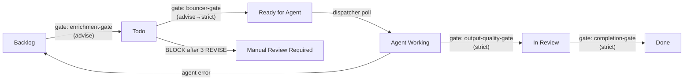
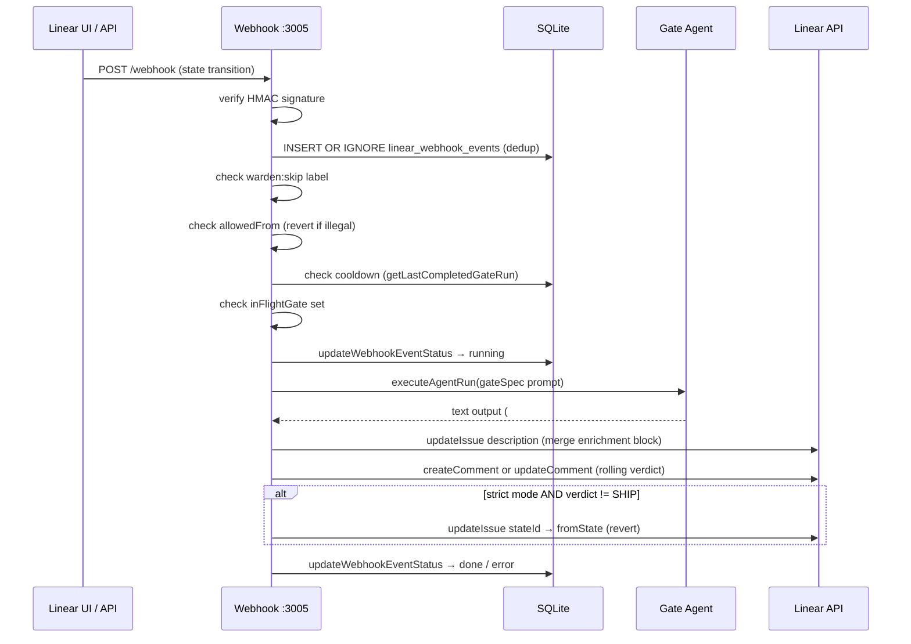
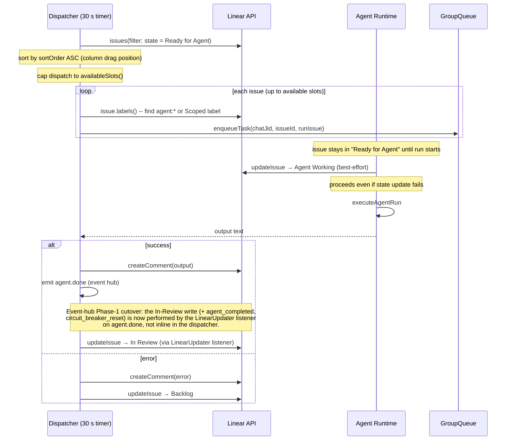

# ADR: Linear Webhook Pipeline -- Dispatch + Warden Gates

**Status:** Accepted
**Date:** 2026-05-22
**Scope:** `src/linear-dispatcher.ts`, `src/linear-webhook.ts`, `src/linear-gate-specs.ts`, `.claude/agents/wardens/`, `src/db.ts`
**Wardens consulted:** Architecture Snapshot, Plan Agent

## Context

Linear is used as the command center for autonomous agent work. Issues move through a Kanban board; when an issue reaches "Ready for Agent" the agent should pick it up without a human in the loop. Two problems arise immediately:

1. **Dispatch gap** - Linear has no native webhook for "move this issue to an agent." Something must poll and translate board state into agent runs.
2. **Quality gap** - Autonomous agents can produce empty output, mis-scope issues, or mark work done prematurely. Human reviewers waste time on bad handoffs. Warden gates are the fix: short-lived agent runs that evaluate each state transition and post a verdict before (or instead of) allowing the move.

This ADR covers both systems and how they share `LinearContext` and `executeAgentRun`.

## Decision

Run two concurrent subsystems off a single `LinearContext`:

- **Polling dispatcher** - polls Linear every 30 s (configurable), picks up "Ready for Agent" issues, dispatches them to the agent runtime, and advances the board.
- **Webhook gate server** - listens on `:3005` for Linear webhooks, runs a warden agent on every configured state transition, posts a rolling comment with the verdict, and optionally reverts bad transitions in strict mode.

Gate specs are markdown files in `.claude/agents/wardens/` with YAML frontmatter. Adding a gate requires only a new file; no code change is needed.

## Architecture

### Full Kanban Flow



Gates fire on transitions into: **Todo**, **Ready for Agent**, **In Review**, **Done**. The enrichment gate (Backlog->Todo) is a Mutating Admission Controller that produces the scope block. The bouncer gate (Todo->RfA) is a Validating Admission Controller that checks scope completeness, with a hash fast-path that skips LLM when enrichment is fresh. The transition into **Agent Working** is made by the dispatcher itself (bot actor) and is skipped by the webhook handler.

### End-to-End Request Flow



### Polling Dispatcher Flow



## Key Components

### LinearContext

Shared state object threaded through both subsystems:

| Field | Type | Purpose |
|---|---|---|
| `client` | `LinearClient` | Authenticated Linear SDK client |
| `stateByName` | `Map<string, WorkflowState>` | Name-keyed state lookup |
| `stateById` | `Map<string, WorkflowState>` | ID-keyed state lookup (webhook payloads carry IDs) |
| `botUserId` | `string` | Used to skip bot-triggered webhook events |
| `dispatchGroup` | `RegisteredGroup` | Virtual group folder for agent runs |
| `inFlightDispatch` | `Set<string>` | Issue IDs currently being dispatched (prevents double-dispatch) |
| `inFlightGate` | `Set<string>` | Issue IDs currently under gate evaluation (prevents concurrent gate runs per issue) |

`initLinearContext` discovers team ID and workflow states at startup. Missing required states (`Ready for Agent`, `Agent Working`, `In Review`, `Backlog`) are a `FatalError` -- the subsystem goes dormant rather than silently misbehave.

### executeAgentRun

Single function used by both the dispatcher and the webhook gate handler. Resolves the configured backend from `RuntimeRegistry`, runs a turn, and returns `{ text, error }`. Gate agents and dispatch agents share the same backend resolution path.

### Gate Specs

Each `.md` file in `.claude/agents/wardens/` with a `gate_to` frontmatter key is a gate spec. `loadGateSpecs` reads them at startup. The spec body is the full warden prompt injected into the agent run.

**Frontmatter schema:**

| Key | Type | Default | Description |
|---|---|---|---|
| `name` | string | filename | Gate display name |
| `gate_to` | string | required | Workflow state that triggers this gate |
| `allowed_from` | string[] | `[]` | Legal source states (empty = any) |
| `mode` | `advise` \| `strict` | `advise` | Whether to revert on non-SHIP verdict |
| `fallback` | `SHIP` \| `REVISE` | `REVISE` | Verdict used when the agent errors |
| `revert_to` | string | fromState | Target state for strict-mode revert (overrides fromState) |
| `cooldown_minutes` | number | 60 | Minimum minutes between gate runs per issue |
| `max_attempts` | number | unset | BLOCK after this many REVISE rounds (moves to Manual Review Required) |
| `effort` | `low` \| `medium` \| `high` | unset | Passed to `RunContext.effort` |
| `fetch_comments` | boolean | `false` | Whether to include issue comments in prompt |

### Webhook Handler

`startLinearWebhookServer` binds to `0.0.0.0:3005`. Every inbound webhook is verified via Linear's HMAC signature before any processing. The handler filters to `action = update` events with a `stateId` change, then runs the gate pipeline.

**Health endpoint:** `GET /health` returns `{ status: "ok", gates: [...] }`.

### SQLite Event Log

Two tables in the shared `db.ts` database:

**`linear_webhook_events`** - one row per webhook event, keyed by `event_key = "{issueId}:{fromStateId}:{toStateId}:{webhookTimestamp}"`. Serves as the dedup key and the audit trail. Status lifecycle: `pending` -> `running` -> `done` / `error`.

**`linear_gate_comments`** - maps `(issue_id, gate_to)` to the comment ID of the last gate verdict comment. Enables rolling update: the same comment is edited on every re-run rather than a new one being created.

## Role Specs (Dispatcher)

Agent role specs live in `.claude/agents/*.md`. Any file with a `linear_label` frontmatter key is loaded as a role spec. The dispatcher matches the issue's `agent:*` label to the role spec, then builds the prompt:

```
<role>   -- role spec body
<issue>  -- title, identifier, description
<comments> -- issue comments (always fetched for dispatch)
```

## Enrichment Gates -- Living Document Pattern

Gate agents can emit an `## Enrichment` section above `## Verdict`. The webhook handler:

1. Extracts the enrichment body.
2. Calls `mergeEnrichment(currentDesc, gateName, body)`, which wraps it in HTML sentinel markers (`<!-- gate:{name}:start -->` / `<!-- gate:{name}:end -->`).
3. Patches the existing sentinel block in-place on re-runs, or appends if absent.
4. Writes the updated description back to Linear.

This means the issue description accumulates structured context from each gate as the issue progresses. The `completion-gate` reads the full description which includes the enrichment block. `extractScopeBlock(description, gateName)` extracts the scope content with a legacy fallback for pre-migration `agent-readiness-gate` sentinels.

### Gate Meta Tracking

The `linear_gate_meta` table tracks per-issue, per-gate metadata:

| Column | Type | Purpose |
|---|---|---|
| `issue_id` | TEXT | Linear issue ID (composite PK) |
| `gate_name` | TEXT | Gate spec name (composite PK) |
| `enrichment_hash` | TEXT | SHA-256 of enrichment block (for bouncer fast-path) |
| `enrichment_snapshot` | TEXT | Full enrichment block at last SHIP |
| `attempt_count` | INTEGER | REVISE round counter (reset on SHIP) |
| `revise_history` | TEXT | JSON array of one-line REVISE summaries (for BLOCK guide) |
| `shipped_at` | TEXT | ISO timestamp of last SHIP |

The bouncer gate uses the enrichment hash for a fast-path: if the hash matches the current description and is less than 72 hours old, SHIP without an LLM call.

## Active Gate Specs

| Gate | Triggers On | Allowed From | Mode | Fallback | Max Attempts | Revert To | Effort | Fetch Comments |
|---|---|---|---|---|---|---|---|---|
| `enrichment-gate` | Todo | Backlog | advise | REVISE | 3 | - | high | no |
| `bouncer-gate` | Ready for Agent | Todo | advise (planned: strict) | REVISE | - | Todo | medium | no |
| `output-quality-gate` | In Review | Agent Working | strict | REVISE | - | Ready for Agent | medium | yes |
| `completion-gate` | Done | (any) | strict | REVISE | - | fromState | medium | yes |

## Triggers and Loop-Break Mechanisms

**What causes a gate to fire:** a Linear webhook `Issue` event with `action = update` and a `stateId` change pointing to a state that has a registered gate spec.

**Loop-break mechanisms (evaluated in order):**

1. **Bot actor skip** - if `payload.actor.id === ctx.botUserId`, the event is skipped. This prevents the dispatcher's own state writes from triggering gates.
2. **`warden:skip` label** - if the issue carries this label, all gate evaluation is skipped for that event.
3. **`Done: Pre-implemented` label** - if the issue carries this label AND the target state is Done, gate evaluation is skipped. For issues that were already implemented outside the normal pipeline.
4. **Dedup** - `INSERT OR IGNORE` on `linear_webhook_events` using `event_key`. Duplicate webhook deliveries are silently dropped.
5. **`allowedFrom` check** - illegal transitions (e.g., Backlog directly to Done) are immediately reverted without running a gate agent.
6. **Cooldown** - if a gate ran for this issue within `cooldown_minutes`, the previous verdict is reused and no agent is spawned.
7. **`inFlightGate`** - if a gate is already running for this issue, the new event is dropped. One gate run per issue at a time.

## UX -- Advise vs Strict Mode

**Advise mode (default):** The gate runs, posts a verdict comment, and the transition stands regardless of verdict. Human is informed but not blocked.

**Strict mode:** On a non-SHIP verdict, the issue is reverted to the `revert_to` state (or the source state if unset), with priority set to 1 (urgent) for re-dispatch. The human or dispatcher must address the gate feedback before re-attempting the move. The `output-quality-gate` and `completion-gate` use strict mode by default.

Strict mode can also be activated per-issue by adding the `warden:strict` label. This overrides the spec-level `mode` field at evaluation time:

```typescript
const effectiveMode = data.labels.some((l) => l.name === 'warden:strict')
  ? 'strict'
  : gateSpec.mode;
```

**Dual-comment model:** Gate comments use two functions with distinct responsibilities:
- `postOrUpdateComment` -- rolling state indicator. The `(issue, gate_to)` tracker in `linear_gate_comments` points at this comment. RUNNING and SHIP verdicts edit it in-place so the issue thread stays clean.
- `postNewGateComment` -- audit trail entry. REVISE, BLOCK, and error verdicts always create a new comment so each bounce reason is independently visible and timestamped. This function does NOT update the tracker, so subsequent RUNNING/SHIP edits go to the rolling comment, not the REVISE entry.

**Comment format:**

```
**Warden: {gateName}** - {SHIP|REVISE|BLOCK}

{agent output (verdict section only, enrichment stripped)}

---
*Gate: {gateName} | Mode: {advise|strict} | {ISO timestamp}*
```

## Configuration

**Required environment variables:**

| Variable | Description |
|---|---|
| `LINEAR_API_TOKEN` | Linear personal API token (also accepted as `LINEAR_API_KEY`) |
| `LINEAR_WEBHOOK_SECRET` | HMAC secret registered with the Linear webhook |

**Optional environment variables:**

| Variable | Default | Description |
|---|---|---|
| `LINEAR_POLL_INTERVAL_MS` | 30000 | How often the dispatcher polls |
| `LINEAR_TEAM_ID` | auto-discovered | Override if account has multiple teams |
| `LINEAR_WEBHOOK_PORT` | 3005 | Port the webhook server binds to |
| `LINEAR_BOT_USER_ID` | authenticated viewer ID | Override to match a dedicated bot account |

**Adding a gate:** create `.claude/agents/wardens/{name}.md` with `gate_to` frontmatter pointing to the target workflow state. Restart Deus. No code change required.

**Removing a gate:** delete the file and restart. The SQLite tables retain history but no new gate runs fire.

## Infrastructure

### Local Development (ngrok)

Linear webhooks require a publicly reachable URL. For local development:

```bash
ngrok http 3005
```

Register the resulting HTTPS URL in the Linear workspace webhook settings. Set `LINEAR_WEBHOOK_SECRET` to the value from Linear's webhook configuration panel.

### Webhook Registration

Linear webhooks must be configured in the workspace settings (Settings > API > Webhooks). Required event: `Issue`. The HMAC secret is set once; rotating it requires updating `LINEAR_WEBHOOK_SECRET` and restarting.

### Credential Proxy Dependency

Gate agents and dispatch agents run through the same agent runtime as all other Deus agents. They use the `linear-dispatch` group folder, which is a virtual group registered at startup. The agent runtime's credential proxy is required to be running -- Linear-sourced agent runs are not exempt from the proxy dependency.

## Pipeline Observability

Every significant pipeline event is logged to the `linear_pipeline_events` table and surfaced in two ways:

> **Event-hub Phase-3 cutover (LIA-166):** the durable write to `linear_pipeline_events`
> for the fire-and-forget `logPipelineEvent` callers now originates from the event-hub
> **ObservabilitySink** listener (on `pipeline.transition`), not inline. The
> `notifyPipelineStep` path keeps a synchronous inline write (it needs the rowid for the
> status-summary update and the row present before it reads the table to rebuild the
> comment below). See [Orchestrator Event Hub](event-hub.md#phase-3-cutover-amendment-lia-166-partial-not-literal-sole-writer).

### Unified pipeline comment

Each issue gets a single rolling **Pipeline Log** comment that updates as events occur. The comment body is rebuilt (materialized view pattern) from the event log on each update. A per-issue promise-chain mutex prevents duplicate comment creation under concurrent events. The comment caps at 50 events with a truncation notice for older entries.

Example comment body:

```
**Pipeline Log**

00:18 -- Gate: agent-readiness-gate -> SHIP
00:19 -- Agent dispatched
00:19 -- Agent started working
00:24 -- PR created -- #488
00:24 -- -> In Review
00:28 -- Gate: output-quality-gate -> SHIP
00:31 -- Auto-merged -> Done
```

Tracked in `linear_pipeline_comments` (issue_id PK, comment_id). Coexists with per-gate verdict comments (different DB table, different content).

### Pipeline CLI

`deus pipeline` queries the event log from the terminal:

```bash
deus pipeline PROJ-123             # Full timeline for an issue
deus pipeline --failed --since 24h # Failures in the last 24 hours
deus pipeline --active             # In-flight issues (no terminal event yet)
deus pipeline --all --since 7d     # All events in the last week
deus pipeline --type gate_revise   # Filter by event type
```

Color-coded output: green (SHIP/merged/completed), red (REVISE/error/failed), yellow (cooldown/pending), cyan (dispatched/started/PR).

### Event types

| Type | Emitted by | Description |
|------|-----------|-------------|
| `gate_ship` | webhook | Gate returned SHIP |
| `gate_revise` | webhook | Gate returned REVISE |
| `gate_cooldown` | webhook | Gate skipped (cooldown active) |
| `gate_error` | webhook | Gate agent errored |
| `agent_dispatched` | dispatcher | Issue enqueued for agent run |
| `agent_started` | dispatcher | Agent container started |
| `agent_completed` | dispatcher | Agent finished successfully |
| `agent_failed` | dispatcher | Agent errored |
| `pr_created` | dispatcher | PR URL extracted from agent output |
| `automerge_pending` | auto-merge | CI poll started |
| `automerge_done` | auto-merge | PR squash-merged |
| `automerge_failed` | auto-merge | CI failed or merge blocked |
| `state_changed` | various | Generic state transition |

### macOS notifications

Every pipeline event also fires a macOS native notification via `osascript` (best-effort, no-op on Linux/Windows). Shows the issue identifier and event label.

## Consequences

- Linear becomes a first-class command interface for autonomous agent work without custom tooling beyond Deus itself.
- Gate specs are plain markdown files -- adding, tuning, or removing a gate requires no TypeScript changes.
- The living document pattern means each issue accumulates verifiable scope and completion records inline, auditable in Linear's native UI.
- Advise-mode gates give signal without blocking velocity; `warden:strict` escalates enforcement per-issue on demand.
- Cooldown and dedup mechanisms prevent runaway agent spend on flapping issues.
- The SQLite event log provides a complete audit trail of every gate evaluation without external infrastructure.
- ngrok (or equivalent tunnel) is a hard dependency for local development; production deployments need a stable public endpoint.

## Revision: 2026-05-24 -- Dispatch Group Elevated to Control Group

The dispatch group (`linear-dispatch`) is now registered with `isControlGroup: true`, and dispatch agent `RunContext` uses `isControlGroup: true`. This enables writable project mounts for dispatch agents that need to create branches, edit files, commit, and push.

Previously `isControlGroup: false` -- the mount at `/workspace/project` was forced readonly by `container-mounter.ts:152` (`effectiveReadonly = project.readonly || !isControlGroup`). Dispatch agents could not make code changes.

Gate agents (webhook handler) remain `isControlGroup: false` -- they only read and evaluate, never modify the project.

Security is maintained through mount allowlist validation at project registration time, sensitive file shadowing (`.env`, credentials, `.git/config`), and container isolation. Existing installs are automatically upgraded on next startup.
